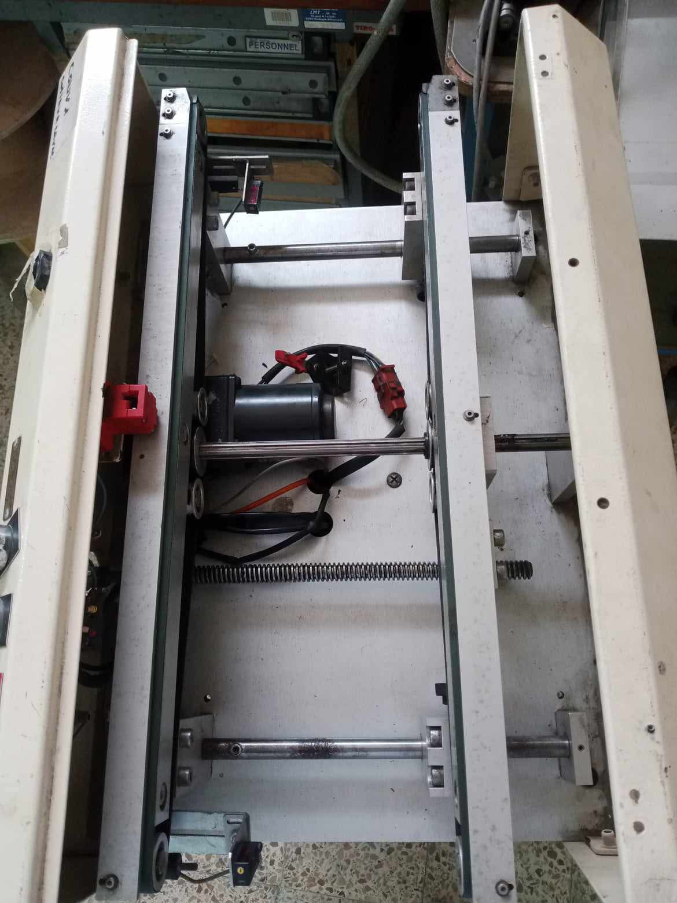
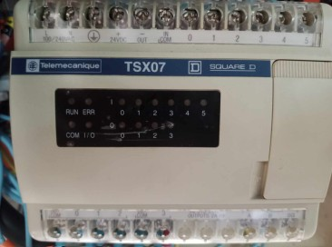

<div align="center">

# STM32-Based Industrial Conveyor Control System

### Legacy Industrial Control Analysis & Embedded-System Modernization

<br>



<br><br>

<p>
  
</p>

<p>
  <b>
    STM32 · Embedded C · PLC · Telemecanique TSX07 ·
    Proteus ISIS 8 · Fritzing
  </b>
</p>

</div>

---

## Overview

This project focuses on the analysis and modernization of an existing
industrial conveyor control system.

The project began with an existing conveyor installation that was no
longer operational. Instead of treating the equipment simply as a
broken machine, it was approached as an engineering problem:
understanding the existing architecture, studying the legacy control
system, identifying practical limitations, and investigating a modern
embedded alternative.

The work combines:

**Industrial Automation · Embedded Systems · Electronics · Sensor
Interfacing · Actuator Control · Control Logic · Hardware Prototyping ·
Circuit Simulation**

The project was developed as an independent engineering initiative,
starting from the physical equipment and progressing toward an
embedded-system-based control approach.

---

# Project Objectives

The main objectives of the project were to:

- Investigate an existing industrial conveyor system
- Understand the architecture of the original control system
- Study the role of the Telemecanique TSX07 PLC
- Identify the sensors and actuators involved in the mechanism
- Analyze the operating sequence of the conveyor
- Identify practical limitations of the existing installation
- Investigate an STM32-based embedded control alternative
- Develop and document the corresponding control logic
- Model the hardware architecture
- Use Proteus ISIS 8 for circuit simulation
- Use Fritzing for hardware prototyping and documentation

The project therefore combines **system investigation**, **industrial
automation**, and **embedded-system development**.

---

# Existing Industrial System

## Telemecanique TSX07 PLC

The original conveyor control architecture was based on a
**Telemecanique TSX07 PLC**.

The controller documented during the project was the:

**Telemecanique TSX07311622 TSX Nano Modicon**

<p align="center">
  
</p>

<p align="center">
  <em>Telemecanique TSX07 PLC from the existing conveyor installation</em>
</p>

The PLC represented the original control layer of the system.

Understanding this controller was an important part of the project because
the objective was to determine how the existing conveyor was controlled
before considering an alternative embedded architecture.

### Existing System Analysis

| System Element | Role |
|---|---|
| TSX07 PLC | Original industrial controller |
| Sensors | Detection and system inputs |
| Motor | Conveyor actuation |
| Control logic | Defines the operating sequence |
| Electrical interfaces | Connects system components |
| Conveyor mechanism | Physical process being controlled |

---

# Why Modernize the Control System?

The existing installation presented several practical limitations that
motivated the investigation of an alternative control architecture.

The project identified constraints including:

- Limited access to the original PLC program
- Difficulty obtaining the required programming and connection cables
- Dependence on manual intervention for motor start/stop
- Legacy hardware and associated maintenance constraints

These limitations led to the investigation of a microcontroller-based
approach.

The objective was not simply to replace a PLC because it was a legacy
device.

The first step was to understand the existing system and determine which
control functions needed to be reproduced or adapted in a modern
embedded architecture.

---

# System Modernization Approach

The project followed a progressive engineering process:

```text
┌──────────────────────────────┐
│      Existing Conveyor      │
└──────────────┬───────────────┘
               │
               ▼
┌──────────────────────────────┐
│   Telemecanique TSX07 PLC   │
└──────────────┬───────────────┘
               │
               ▼
┌──────────────────────────────┐
│    Existing-System Study    │
└──────────────┬───────────────┘
               │
               ▼
┌──────────────────────────────┐
│ Identify System Limitations │
└──────────────┬───────────────┘
               │
               ▼
┌──────────────────────────────┐
│   Embedded-System Approach  │
└──────────────┬───────────────┘
               │
               ▼
       ┌─────────────────┐
       │ STM32 Controller│
       └────────┬────────┘
                │
        ┌───────┼────────┐
        │       │        │
        ▼       ▼        ▼
     Sensors  Logic   Actuators
        │       │        │
        └───────┼────────┘
                │
                ▼
┌──────────────────────────────┐
│  Simulation & Prototyping   │
└──────────────────────────────┘
